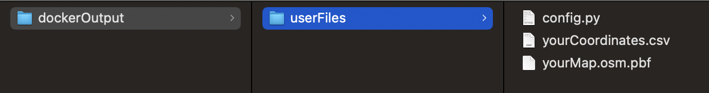
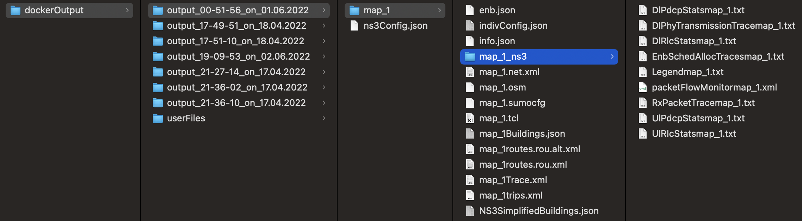

## Mobility Testbed

#### A mmWave mobility simulator combining [Open Street Map](https://www.openstreetmap.org), [NS3](https://www.nsnam.org), and [SUMO](https://sumo.dlr.de/docs/index.html)
<br>

### Setting up the testbed docker image
 <br>

1. Install [Docker](https://www.docker.com)

2. Pull the testbed image:
 
     ```docker pull jcuthbert/mobility-testbed```

3. Pull the GitHub repo and locate the `dockerOutput` folder this will be where the simulator outputs; also within it is a `userFiles` folder where the simulator will pull the configuration files. Below is an example of the three input files for the testbed: 


     

     * `config.py` is provided in the userFiles folder and can be edited to change simulation parameters

     * `yourMap.osm.pbf` file is an open street map file, information on downloading map segments can be found [here](https://wiki.openstreetmap.org/wiki/Downloading_data)

     * `yourCoordinates.csv` contains lat long coordinates, two sets of coordinates define areas to cut out of the .osm.pbf file; the default format is below; however this can be configured in `config.py` 
          ```
          lat, long
          lat, long 
          ```
          example:
          ```
          40.0077,-75.1339
          29.7863,-95.3889
          ```
     
          


4. Once you have configured the simulation you want to run and gotten the map and the coordinates you can use the following command to start the docker image; which will enter you into an interactive shell with its own "file system". The `-v` option is creating a local volume; which links your dockerOutput folder to the `/home/testbed/outputMaster` directory in the container.

     ```
     docker container run --interactive --tty  -v ..YOUR-PATH../dockerOutput:/home/testbed/outputMaster jcuthbert/mobility-testbed:latest /bin/bash
     ```

5. At this point the container should be running; run the following commands to activate the python virtual environment and begin the simulation. Note: if you want to edit your `config.py` simulation parameters while the image is running edit `/home/testbed/src/config.py` within the containers interactive shell. 

     ``` 
     source ./bin/activate
     python src/main.py
     ```

6. The simulation should begin; with status messages on the command line. As it runs output files and intermediatry files such as the SUMO route files will begin being generated in the `dockerOutput` shared volume. Each time you begin the simulation a new timestamped subfolder will be created. 

     

     Although a different version of the ns3-mmwave than used in the simulator [this](https://github.com/nyuwireless-unipd/ns3-mmwave/wiki/ns3-mmWave-traces) is a helpful page for understanding the ns3 output files. 

<br>

### Building the dockerfile

1. Get this repository; there is a dockerfile with all the build instructions in it; however you will need two additional repositories for the testbed to work: a fork of the ns3 MmWave standalone, and a c++ json library.
2. First create a new directory in the `mobility-testbed` called `ns3`. Within the new directory get [this](https://github.com/jcuberdruid/ns3-mmwave-antenna) fork of the ns3 WmWave respository-- The only change to the original is an enviroment variable, and the inclusion of the `ns2TraceInterface.cc` script for taking in simulation parameters from python. 
3. Again within the `ns3` directory you created get [this](https://github.com/nlohmann/json/releases) json library-- note that you will want the standalone version.
4. At this point you should have the following within the `ns3` directory:  

   
5. Build the docker file with the command `docker build . -t mobility-testbed`. You should see a new image appear when you run the command:  `docker image list`. As needed refer to the previous instructions for setting up the testbed with this new image; ommiting the pulling of the public image. 